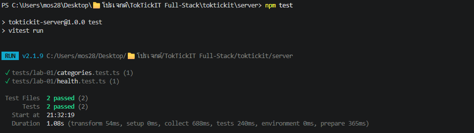
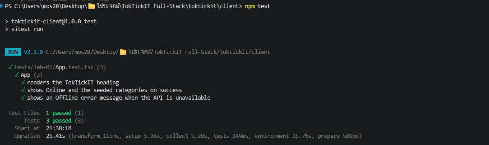

# Lab 1 - Test Plan and Evidence

All automated test files are located under:

- `server/tests/lab-01/`
- `client/tests/lab-01/`

## Automated Tests

| Test ID | Test File | Tool | Test Description | Result |
|---|---|---|---|---|
| API-01 | `server/tests/lab-01/health.test.ts` | Supertest + Vitest | `GET /api/health` returns HTTP 200 and the expected JSON response | Passed |
| API-02 | `server/tests/lab-01/categories.test.ts` | Supertest + Vitest | `GET /api/categories` returns the four seeded categories in ID order | Passed |
| UI-01 | `client/tests/lab-01/App.test.tsx` | Vitest + Testing Library | The TokTickIT heading renders | Passed |
| UI-02 | `client/tests/lab-01/App.test.tsx` | Vitest + Testing Library | A successful API request displays Online and the four categories | Passed |
| UI-03 | `client/tests/lab-01/App.test.tsx` | Vitest + Testing Library | An unavailable API displays Offline and a useful error message | Passed |

## Commands Used

Backend tests:

```powershell
npm --prefix server test
```

Frontend tests:

```powershell
npm --prefix client test
```

## Passing Terminal Output

### Backend Tests



- Test Files: 2 passed
- Tests: 2 passed

### Frontend Tests



- Test Files: 1 passed
- Tests: 3 passed